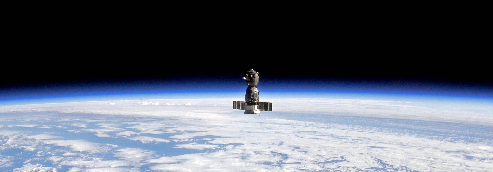

<!-- <h2>👋 &nbsp;Hey there! I'm Ulises</h2> -->

## 👋 &nbsp;Hey there! I'm Ulises

### 👨🏻‍💻 &nbsp;About me

💡 &nbsp;I like to explore new technologies and develop software solutions and quick hacks.\
🎓 &nbsp;I'm currently studying Computer Engineering at Universidad Politécnica de Madrid (UPM).\
🌱 &nbsp;I'm on track for learning more about Artificial Intelligence, Blockchain Transaction Automatization and other new technologies.\
💬 &nbsp;Feel free to reach out to me for everything you want!\
✉️ &nbsp;You can send me an email at usbrgr@gmail.com!\
📄 &nbsp;Please have a look at my [LinkedIn Profile](https://www.linkedin.com/in/ulisesbg/) for more details about me.

<!--  -->

### 🛠 &nbsp;Technologies
<!-- >
![Python]
![JavaScript]
![Java]
![C]
Docker
Latex
Shell Script
Gitlab
Asana
Jupyter
Pandas
Numpy
![HTML]
![CSS]
![Git]
![GitHub]
![Markdown]
![Visual Studio Code]
![Eclipse]
![Photoshop]

-->

<!-- ### ⚙️ &nbsp;GitHub Analytics

-->
### 🤝🏻 &nbsp;Reach me out!
<!--

-->

-----

</a>

Profile: [Ulises Bértolo](https://github.com/ulisesbg)

Last Edited on: 12/11/2021
